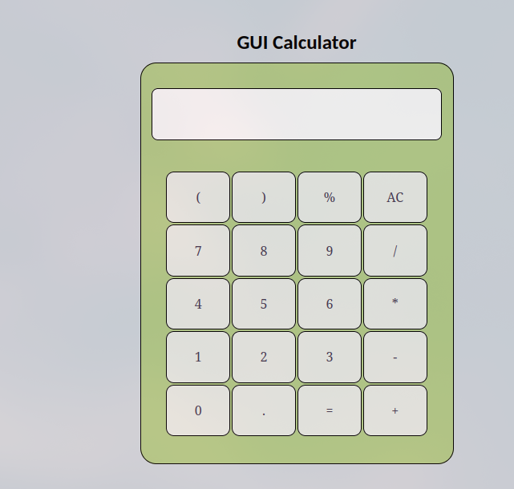

# GUI Calculator

A simple and interactive graphical calculator built with HTML, CSS, and JavaScript. This calculator supports basic arithmetic operations and features a clean, user-friendly interface.

## Features

- Basic arithmetic operations: addition (`+`), subtraction (`-`), multiplication (`*`), division (`/`)
- Parentheses support: `( )`
- Percentage `%` calculation
- Clear (`AC`) button to reset the input
- Real-time input display and result output
- Error handling for invalid expressions

## Demo
Try the calculator live [here](https://anush980.github.io/GUI-calculator/).

## Screenshots

